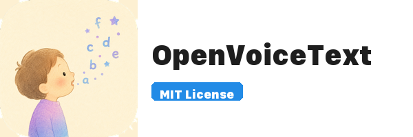

<p align="center">
  
</p>

<p align="center">
  <a href="https://github.com/hibachi-inc/OpenVoiceText/releases/latest/download/OpenVoiceText-0.1.0.dmg"></a>
  &nbsp;
  <a href="https://github.com/hibachi-inc/OpenVoiceText/releases/latest"></a>
</p>

<p align="center">
  [English](#english) | <a href="#日本語">日本語</a>
</p>

---

<a id="english"></a>

Context-aware voice input for macOS. Speak into any app and get clean, formatted text — entirely on-device.

**Zero dependencies. Zero network. Zero subscription.**

Built with Apple Speech framework + Apple FoundationModels. No Whisper, no cloud APIs, no model downloads.

> **macOS 14+, Apple Silicon** — [Download the latest DMG here](https://github.com/hibachi-inc/OpenVoiceText/releases/latest/download/OpenVoiceText-0.1.0.dmg). Open the `.dmg`, drag the app to Applications, done.

## How it works

1. Press **⌥Space** to start recording
2. Speak naturally
3. Press **⌥Space** again to stop
4. Text is refined based on the active app and inserted automatically

The app detects which app is focused and adjusts refinement style:

| App type | Style | Examples |
|---|---|---|
| Chat | Concise, conversational | Slack, Discord, Messages |
| Email | Polished, complete sentences | Mail, Outlook, Spark |
| Code | Preserves identifiers and symbols | Xcode, VS Code, Cursor |
| Terminal | Preserves commands and flags | Terminal, iTerm, Warp |
| Notes | Structured with bullet points | Notion, Obsidian, Bear |
| Browser | Concise for forms and comments | Safari, Chrome, Arc |
| Generic | Natural, well-formatted text | Everything else |

## Architecture

Three-process design using XPC for crash isolation:

```
OpenVoiceText.app (main process)
├── UI, hotkey, state machine, coordination
│
├── STT Service (XPC)
│   └── SFSpeechRecognizer + AVAudioEngine
│
└── Refiner Service (XPC)
    └── Apple FoundationModels (on-device LLM)
```

If the speech engine crashes, the main app stays alive. If the LLM hangs, it times out and inserts raw text. The UI never freezes.

## Requirements

| Feature | Minimum macOS |
|---|---|
| Voice input (STT only) | macOS 14 Sonoma |
| AI text refinement | macOS 26 Tahoe + Apple Intelligence |

On macOS 14–15, the app works as a voice input tool without AI refinement (raw transcript is used as-is).

FoundationModels requires Apple Silicon and Apple Intelligence to be enabled in System Settings.

## Permissions

The app requests these permissions on first launch:

- **Microphone** — to capture speech
- **Speech Recognition** — for on-device transcription

Both are processed entirely on-device. No audio or text data ever leaves your Mac.

## Build

Requires Xcode 16+ and Swift 6.0+.

```bash
git clone https://github.com/hibachi-inc/OpenVoiceText.git
cd OpenVoiceText
make run
```

This builds all three targets (app + 2 XPC services), assembles the `.app` bundle, signs it ad-hoc, and launches it.

### Build targets

| Target | Description |
|---|---|
| `VoiceFlowApp` | Main app (menu bar, HUD, hotkey) |
| `VoiceFlowSTT` | Speech-to-text XPC service |
| `VoiceFlowRefiner` | Text refinement XPC service |

### Run tests

```bash
swift test
```

62 tests across 4 suites: state machine, app context, recording coordinator, and SimpleRefiner.

### Distribution builds

```bash
make bundle-mas   # Mac App Store (App Sandbox)
make bundle-dmg   # Direct distribution (Hardened Runtime)
make release      # Build + sign + notarize + GitHub Release
```

### Direct distribution build

For the direct distribution version (auto-paste via Accessibility API instead of clipboard):

```bash
swift build -Xswiftc -DDIRECT
```

This enables `AccessibilityInjector` which simulates ⌘V to paste text at the cursor position. Requires Accessibility permission.

## Project structure

```
Sources/
├── VoiceFlowApp/          # Main process
│   ├── App/               # Entry point, AppDelegate, GlobalHotkey
│   ├── Core/              # State machine, coordinator, app context
│   ├── Injector/          # ClipboardInjector / AccessibilityInjector
│   ├── Store/             # PreferencesStore, HistoryStore, ProUpgradeManager
│   ├── UI/                # Floating HUD, SwiftUI views, Settings
│   └── XPC/               # XPC client wrappers with timeout
├── VoiceFlowSTT/          # STT XPC service
├── VoiceFlowRefiner/      # Refiner XPC service (FoundationModels)
└── VoiceFlowProtocol/     # Shared XPC protocol definitions
```

## Comparison

| App | STT | Refinement | Context-aware | Fully local | Open source |
|---|---|---|---|---|---|
| **OpenVoiceText** | Apple Speech | Apple FoundationModels | Yes | Yes | Yes (MIT) |
| SuperWhisper | Whisper | Cloud | No | No | No |
| Wispr Flow | Cloud | Cloud | No | No | No |
| VoiceInk | Whisper | Ollama/Cloud | Partial | Partial | Yes |
| Amical | Whisper | Ollama/Cloud | Yes | Partial | Yes |

## License

[MIT](LICENSE) — Hibachi Inc.

---

<a id="日本語"></a>

# OpenVoiceText（日本語）

macOS向けのコンテキスト認識型オンデバイス音声入力アプリ。あらゆるアプリに話しかけるだけで、整形されたテキストが入力される。

**依存なし。通信なし。サブスクなし。**

Apple Speech フレームワークと Apple FoundationModels で構築。Whisper不要、クラウドAPI不要、モデルダウンロード不要。

## ダウンロード

> **macOS 14以降、Apple Silicon** — [最新版DMGをダウンロード](https://github.com/hibachi-inc/OpenVoiceText/releases/latest/download/OpenVoiceText-0.1.0.dmg)。`.dmg` を開いてアプリをApplicationsにドラッグするだけ。
>
> どれをダウンロードすればいいか分からない場合は、[リリースページ](https://github.com/hibachi-inc/OpenVoiceText/releases/latest)を開いて `.dmg` ファイルをクリック。

## 使い方

1. **⌥Space** で録音開始
2. 自然に話す
3. もう一度 **⌥Space** で録音停止
4. アクティブなアプリに合わせてテキストが整形・挿入される

フォーカスされているアプリを検知し、整形スタイルを自動で調整する:

| アプリ種別 | スタイル | 例 |
|---|---|---|
| チャット | 簡潔・会話調 | Slack、Discord、メッセージ |
| メール | 丁寧・完全な文 | Mail、Outlook、Spark |
| コード | 識別子・記号を保持 | Xcode、VS Code、Cursor |
| ターミナル | コマンド・フラグを保持 | Terminal、iTerm、Warp |
| ノート | 箇条書き構造化 | Notion、Obsidian、Bear |
| ブラウザ | フォーム・コメント向け簡潔 | Safari、Chrome、Arc |
| 汎用 | 自然で整形されたテキスト | その他すべて |

## アーキテクチャ

XPC によるプロセス分離設計（3プロセス構成）:

```
OpenVoiceText.app（メインプロセス）
├── UI、ホットキー、状態マシン、調整
│
├── STT サービス（XPC）
│   └── SFSpeechRecognizer + AVAudioEngine
│
└── Refiner サービス（XPC）
    └── Apple FoundationModels（オンデバイスLLM）
```

音声エンジンがクラッシュしてもメインアプリは生き残る。LLMがハングしてもタイムアウトして生テキストを挿入する。UIがフリーズすることはない。

## 動作要件

| 機能 | 最低macOSバージョン |
|---|---|
| 音声入力（STTのみ） | macOS 14 Sonoma |
| AIテキスト整形 | macOS 26 Tahoe + Apple Intelligence |

macOS 14〜15では、AI整形なしの音声入力ツールとして動作する（生の文字起こしがそのまま使われる）。

FoundationModelsはApple Siliconと、システム設定でApple Intelligenceが有効になっている必要がある。

## 権限

初回起動時に以下の権限を要求する:

- **マイク** — 音声の取り込み
- **音声認識** — オンデバイスでの文字起こし

すべてオンデバイスで処理される。音声やテキストデータがMacの外に送信されることはない。

## ビルド

Xcode 16以降、Swift 6.0以降が必要。

```bash
git clone https://github.com/hibachi-inc/OpenVoiceText.git
cd OpenVoiceText
make run
```

3つのターゲット（アプリ + XPCサービス2つ）をビルドし、`.app` バンドルを組み立て、ad-hoc署名して起動する。

### ビルドターゲット

| ターゲット | 説明 |
|---|---|
| `VoiceFlowApp` | メインアプリ（メニューバー、HUD、ホットキー） |
| `VoiceFlowSTT` | 音声認識 XPC サービス |
| `VoiceFlowRefiner` | テキスト整形 XPC サービス |

### テスト実行

```bash
swift test
```

### 直接配布ビルド

アクセシビリティAPI経由の自動ペースト版（クリップボードの代わり）:

```bash
swift build -Xswiftc -DDIRECT
```

`AccessibilityInjector` が有効になり、⌘Vをシミュレートしてカーソル位置にテキストを貼り付ける。アクセシビリティ権限が必要。

## プロジェクト構成

```
Sources/
├── VoiceFlowApp/          # メインプロセス
│   ├── App/               # エントリポイント、AppDelegate
│   ├── Core/              # 状態マシン、コーディネーター、アプリコンテキスト
│   ├── Injector/          # ClipboardInjector / AccessibilityInjector
│   ├── UI/                # フローティングHUD、SwiftUIビュー
│   └── XPC/               # タイムアウト付きXPCクライアント
├── VoiceFlowSTT/          # STT XPC サービス
├── VoiceFlowRefiner/      # Refiner XPC サービス（FoundationModels）
└── VoiceFlowProtocol/     # 共有XPCプロトコル定義
```

## 比較

| アプリ | STT | 整形 | コンテキスト認識 | 完全ローカル | OSS |
|---|---|---|---|---|---|
| **OpenVoiceText** | Apple Speech | Apple FoundationModels | あり | あり | あり（MIT） |
| SuperWhisper | Whisper | クラウド | なし | なし | なし |
| Wispr Flow | クラウド | クラウド | なし | なし | なし |
| VoiceInk | Whisper | Ollama/クラウド | 一部 | 一部 | あり |
| Amical | Whisper | Ollama/クラウド | あり | 一部 | あり |

## ライセンス

[MIT](LICENSE) — ヒバチ株式会社

---

Built by [Hibachi Inc.](https://hibachi.co.jp) — makers of [Reki note](https://rekinote.app/)
